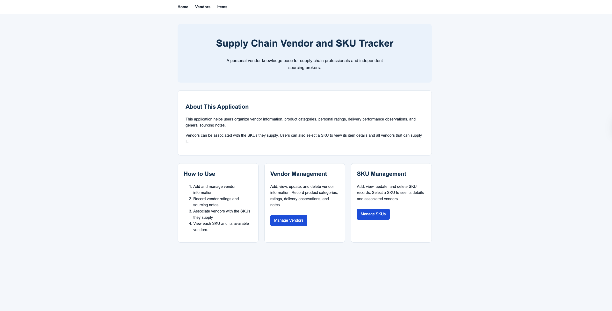
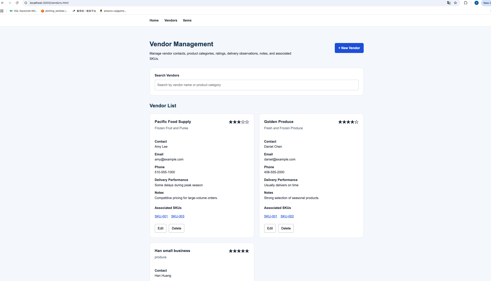
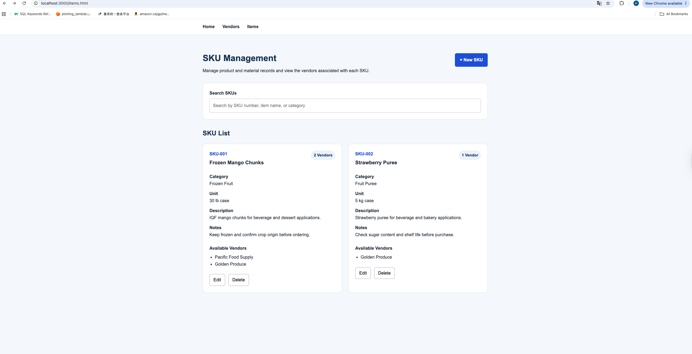

# Supply Chain Vendor and SKU Tracker

## Author:

Han Huang

A full-stack web application for managing supply chain vendors and SKU information.

Users can create, search, edit, and delete vendor and item records. Vendor records can be connected to associated SKUs, and item records can include associated vendors.

## Project Objective

The objective of this project is to create a full-stack supply chain knowledge base that allows users to manage vendor and SKU records in one central location.

The application helps supply chain professionals, buyers, and sourcing brokers store supplier information, delivery observations, product details, and vendor-SKU relationships. It replaces scattered spreadsheets, emails, and personal notes with a searchable web application backed by MongoDB.

## Course

**Course:** Web Development  
**Class link**
https://johnguerra.co/classes/webDevelopment_online_summer_2026/

## Screenshots

### Home Page



### Vendors Page



### Items Page



## How to Use

1. Open the home page and choose either Vendors or Items.
2. Use the Vendors page to view, search, add, edit, or delete supplier records.
3. Use the Items page to view, search, add, edit, or delete SKU records.
4. Enter associated SKUs in vendor records to track which products a supplier provides.
5. Enter associated vendor names in item records to track possible suppliers.
6. Use the Edit and Delete buttons on each card to maintain current information.

## Features

- View all vendors
- Search vendors
- Add, edit, and delete vendors
- View all SKUs/items
- Search SKUs/items
- Add, edit, and delete SKUs/items
- Store vendor and SKU relationships
- Save data permanently in MongoDB
- Client-side rendering using JavaScript ES modules

## Technology Stack

### Frontend

- HTML5
- CSS3
- Vanilla JavaScript
- ES6 modules
- Fetch API

### Backend

- Node.js
- Express.js

### Database

- MongoDB
- Official MongoDB Node.js Driver
- Docker and Docker Compose

## Project Structure

```text
Supply-Chain-Vendor-and-SKUs-Tracker/
├── db/
│   ├── mongo.js
│   └── seed.js
├── public/
│   ├── css/
│   ├── js/
│   ├── index.html
│   ├── vendors.html
│   └── items.html
├── routes/
│   ├── vendors.js
│   └── items.js
├── docker-compose.yml
├── eslint.config.js
├── package.json
├── server.js
└── README.md
```

## Installation

Clone the repository:

```bash
git clone https://github.com/HedyHHuang/Supply-Chain-Vendor-and-SKUs-Tracker.git
```

Enter the project directory:

```bash
cd Supply-Chain-Vendor-and-SKUs-Tracker
```

Install the dependencies:

```bash
npm install
```

## Start MongoDB

Make sure Docker Desktop is running.

Start the MongoDB container:

```bash
docker compose up -d
```

Check that MongoDB is running:

```bash
docker compose ps
```

## Add Initial Data

Run the seed script:

```bash
node db/seed.js
```

Warning: running the seed script deletes the existing vendor and item records before adding the initial sample data.

## Start the Application

Start the Express server:

```bash
npm start
```

Open the application in a browser:

```text
http://localhost:3000
```

## Development Commands

Run the server with automatic restart:

```bash
npm run dev
```

Check the JavaScript code with ESLint:

```bash
npm run lint
```

Format the project with Prettier:

```bash
npm run format
```

Check the formatting without changing files:

```bash
npm run format:check
```

## API Endpoints

### Vendors

```text
GET    /api/vendors
POST   /api/vendors
PUT    /api/vendors/:id
DELETE /api/vendors/:id
```

### Items

```text
GET    /api/items
POST   /api/items
PUT    /api/items/:id
DELETE /api/items/:id
```
