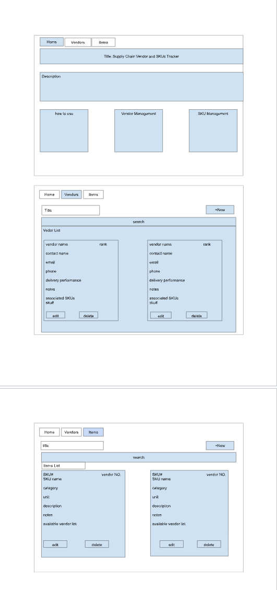

Supply Chain Vendor and SKU Tracker
Design Document
Author: Han Huang

1. Project Description
   The Supply Chain Vendor and SKU Tracker is a full-stack web application designed to help supply chain professionals and independent sourcing brokers organize vendor and product information in one place.
   In many small businesses, the vendor contact information, product details, delivery performance, and sourcing notes are stored across spreadsheets, emails, and personal documents. This makes it difficult to quickly locate reliable suppliers or review product history.
   This application allows users to:
   Add, view, search, edit, and delete vendor records
   Add, view, search, edit, and delete SKU records
   Save vendor contact information and product categories
   Record vendor ratings
   notes: such as delivery performance, communication tips
   Connect vendors with related SKUs
   Connect SKU records with available vendors
   Permanently store information in MongoDB
   The project uses Node.js, Express, MongoDB, HTML5, CSS, and Vanilla JavaScript.
2. Project Objective
   The objective of this project is to create a simple and useful supply chain knowledge base.
   The application gives users one central location for vendor and SKU information instead of requiring them to search through spreadsheets, emails, and separate documents.
   The system is designed to make supplier research, product sourcing, and vendor management faster and easier.
3. Target Users
   The main users of this application are:
   Supply chain managers
   Procurement specialists
   Buyers
   Sourcing professionals
   Independent sourcing brokers
   Small business owners who manage vendors and products
4. User Personas
   Persona 1: Hedy — Supply Chain Manager
   Age: 34
   Role: Supply Chain Manager
   Experience: 7 years in procurement and supply chain management
   Background:
   Hedy manages suppliers for a food and beverage company. She works with many vendors and frequently needs to review contact information, delivery history, product categories, and sourcing notes.
   Goals:
   Keep all vendor information in one place
   Quickly search for suppliers
   Review delivery performance before placing an order
   Identify which SKUs are supplied by each vendor
   Update outdated supplier information
   Challenges:
   Vendor information is stored in different spreadsheets
   Important notes are sometimes lost in emails
   It takes too long to identify backup suppliers
   Product and vendor relationships are difficult to track
   Persona 2: Alex — Independent Sourcing Broker
   Age: 29
   Role: Independent Sourcing Broker
   Experience: 4 years helping small businesses locate suppliers
   Background:
   Alex works with multiple clients and needs to maintain information about suppliers, products, pricing discussions, and sourcing observations.
   Goals:
   Quickly find vendors by product category
   Store supplier contact details
   Record notes about vendor reliability
   Identify which vendors can supply a specific SKU
   Maintain a reusable sourcing database
   Challenges:
   Supplier information is spread across personal notes
   It is difficult to remember which vendor supplies each product
   Vendor performance information is not organized
   Client requests often require fast supplier research
5. User Stories
   Vendor User Stories
   As a supply chain manager, I want to view all vendors so that I can review the suppliers currently stored in the system.
   As a supply chain manager, I want to add a vendor so that I can save new supplier contact and performance information.
   As a user, I want to search for a vendor by name, contact person, or product category so that I can quickly find the supplier I need.
   As a user, I want to edit a vendor record so that I can correct outdated contact, rating, or delivery information.
   As a user, I want to delete an inactive vendor so that the database remains current and useful.
   As a sourcing professional, I want to record delivery performance and notes so that I can make better purchasing decisions.
   As a sourcing professional, I want to associate vendors with SKUs so that I can identify which products each vendor supplies.
   SKU User Stories
   As a buyer, I want to view all SKU records so that I can review the products stored in the system.
   As a buyer, I want to add a new SKU so that I can save product information.
   As a user, I want to search by SKU number, product name, or category so that I can quickly locate a product.
   As a user, I want to edit a SKU so that I can update product descriptions, units, notes, or associated vendors.
   As a user, I want to delete an obsolete SKU so that the product database remains accurate.
   As a sourcing broker, I want to see the vendors associated with a SKU so that I can identify possible suppliers.
6. Main Use Cases
   Use Case 1: Add a Vendor
   The user opens the Vendors page.
   The user selects the Add Vendor button.
   The vendor form becomes visible.
   The user enters the vendor information.
   The user submits the form.
   The application sends the information to the Express API.
   The vendor is stored in MongoDB.
   The vendor list is updated on the page.
   Use Case 2: Edit a Vendor
   The user selects Edit on a vendor card.
   The form is filled with the existing vendor information.
   The user updates the information.
   The application sends an update request to the API.
   MongoDB updates the vendor record.
   The updated information appears on the page.
   Use Case 3: Search for a SKU
   The user opens the Items page.
   The user enters a keyword in the search field.
   JavaScript filters the currently displayed SKU records.
   Matching records remain visible.
   Use Case 4: Delete a Record
   The user selects Delete on a vendor or SKU card.
   The application asks for confirmation.
   The user confirms the deletion.
   The application sends a delete request to the API.
   MongoDB removes the record.
   The updated list is rendered on the page.
7. Application Pages
   Home Page
   The home page introduces the application and helps users navigate to the Vendors and Items pages.
   Vendors Page
   The Vendors page allows users to:
   View vendor cards
   Search vendors
   Add vendors
   Edit vendors
   Delete vendors
   Review ratings, performance, notes, and associated SKUs
   Items Page
   The Items page allows users to:
   View SKU cards
   Search products
   Add SKU records
   Edit SKU records
   Delete SKU records
   Review descriptions, units, notes, and associated vendors
8. Technical Design
   Frontend
   HTML5
   CSS3
   Vanilla JavaScript
   ES6 modules
   Fetch API
   Client-side rendering
   Backend
   Node.js
   Express.js
   ES modules
   Database
   MongoDB
   Official MongoDB Node.js Driver
   Two collections:
   vendors
   items
   Development Tools
   Docker
   Docker Compose
   ESLint
   Prettier
   Git
   GitHub
9. Data Model
   Vendor Record
   A vendor record contains:
   Vendor ID
   Vendor name
   Contact person
   Email
   Phone
   Website
   Product categories
   Rating
   Delivery performance
   Notes
   Associated SKUs
   SKU Record
   An SKU record contains:
   Item ID
   SKU number
   Item name
   Category
   Unit
   Description
   Notes
   Associated vendors
10. Design Mockups
    The initial design includes three main pages:
    Home page
    Vendors page
    Items page
    The mockups show the planned navigation, forms, search fields, vendor cards, SKU cards, and action buttons.
    
11. Design Decisions
    The application uses separate pages for Vendors and Items so that users can focus on one type of record at a time.
    Cards are used to display records because they make important information easy to scan.
    Forms are hidden until the user chooses to add or edit a record, which keeps the page cleaner.
    Buttons use standard HTML button elements for accessibility and usability.
    Client-side rendering is used so that records can be updated without reloading the entire page.
    MongoDB is used because vendor and SKU records contain flexible fields and arrays, such as associated SKUs and associated vendors.
12. Future Improvements
    Possible future improvements include:
    User authentication
    Automatic synchronization between vendor and SKU relationships
    Pagination for large datasets
    Sorting by vendor rating
    Filtering by category
    Uploading vendor documents
    Exporting records to CSV
    Tracking product prices
    Tracking purchase order history
